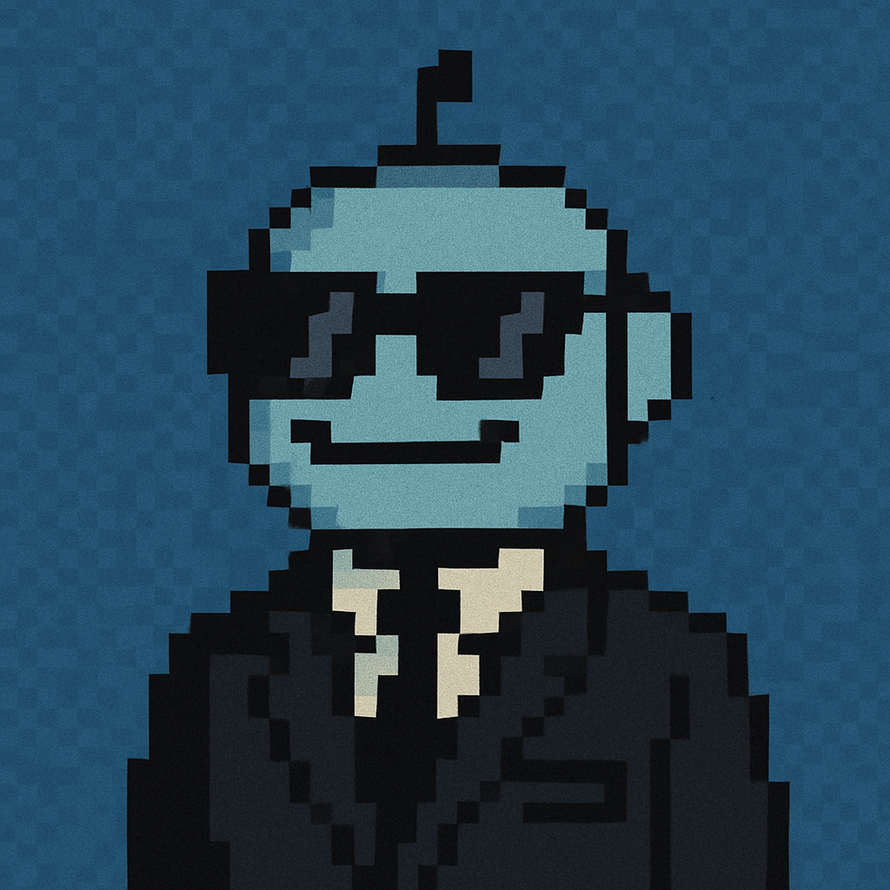

# Azure AI Foundry Agents Demos - WIP

This repository contains sample code and instructions for creating a variety of simple Azure AI Foundry Agents. Demos include those for using tools like Grounding with Bing Search, MCP servers, and OpenAPI schemas. Also included are walkthroughs for enterprise features like observability, secure networking, and more.

## Index of Demos

- [/mcp_learn_agent](/mcp_learn_agent): Using an MCP tool to connect to the Microsoft Learn MCP server; absolute minimal demo. 
- [/mcp_local_server_agent](/mcp_local_server_agent): A three step demo walking through setting up a local MCP server, inspecting it with the MCP inspector client, and connecting to it with an agent with auth at runtime. 
- [/otel_observable_agent](/otel_observable_agent): Integration with OpenTelemetry and Azure App Insights for observability, as well as extreme verbosity in output for debugging. 

## TODO

- [x] Minimal MCP tool demo with the Microsoft Learn MCP server
- [x] Local MCP server, inspector, and agent connection with auth
- [ ] Observability demo (App Insights, per-delta verbose output)
- [ ] Copilot studio integration with agent (Teams bot to add RBAC roles for users, grounded with policy (Fabric?), logged, permission approval) 

  

