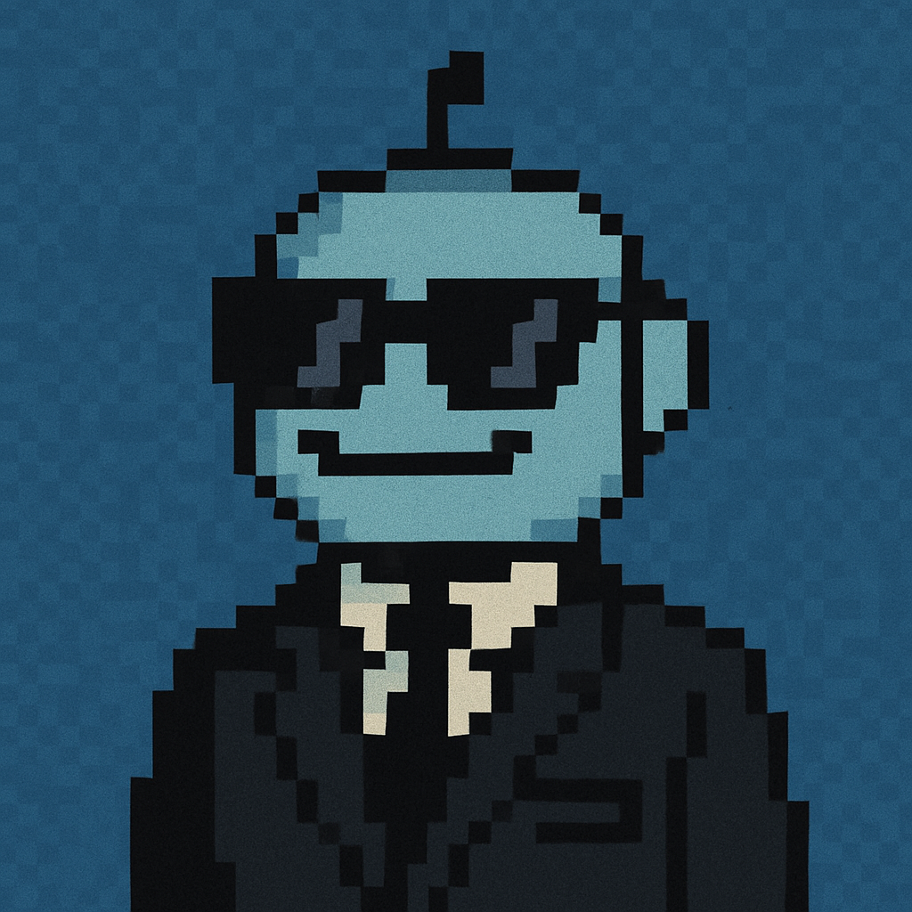

# Azure AI Foundry Agents Demos

Sample code and walkthroughs for building Azure AI Foundry Agents using the GA v2 SDK (`azure-ai-projects>=2.0.0`). Demos cover MCP server integration, Code Interpreter, and enterprise patterns like credential isolation via Foundry project connections.

## Demos (v2 — GA SDK + New Foundry UI)

| Demo | Description | Tools | Tests |
|------|-------------|-------|-------|
| [enterprise_github_agent](enterprise_github_agent/) | GitHub integration with code execution | MCP (GitHub) + Code Interpreter | 42 |
| [mcp_mslearn_agent](mcp_mslearn_agent/) | Search Microsoft Learn documentation | MCP (MS Learn, public) | 41 |
| [mcp_local_server_agent](mcp_local_server_agent/) | Local MCP server with Chinook SQLite DB | MCP (custom, local + ngrok) | 84 |

Every demo follows a consistent pattern:
- `create_agent.py` — Create the agent (run once)
- `ask_agent.py` — Interactive chat REPL with streaming output
- `.env.sample` — Required environment variables
- `requirements.txt` — Python dependencies
- `README.md` — Setup and walkthrough

## Training labs

The [`training/l200-tools/`](training/l200-tools/) suite accompanies the L200 Foundry tools training
module for support engineers. Unlike the standalone demos, these labs form one sequence and share a
single Python environment:

1. Toolbox versioning
2. Azure AI Search grounding
3. Foundry IQ knowledge base

The training README starts with Python, Git, Azure CLI, virtual-environment, dependency, and
configuration setup for learners who have not used Python before.

## Quick Start

```bash
# Pick a demo directory
cd enterprise_github_agent  # or mcp_mslearn_agent, mcp_local_server_agent

# Set up
python -m venv .venv && source .venv/bin/activate
pip install -r requirements.txt
cp .env.sample .env
# Fill in PROJECT_ENDPOINT and MODEL_DEPLOYMENT_NAME

# Create the agent and chat
python create_agent.py
python ask_agent.py
```

See each demo's README for detailed setup instructions.

## Prerequisites

- Python 3.11+
- An Azure AI Foundry project with a deployed model
- Azure CLI logged in (`az login`) for `DefaultAzureCredential`

## Architecture

All demos use the [GA V2 SDK](https://learn.microsoft.com/python/api/overview/azure/ai-projects-readme):
- Agent creation via `PromptAgentDefinition` + `create_version()`
- Conversations via OpenAI Responses API (`responses.create()`)
- Credentials in Foundry project connections (not in code)

See [docs/architecture/overview.md](docs/architecture/overview.md) for details and [docs/architecture/decisions/](docs/architecture/decisions/) for ADRs.

## Archived Demos (v1)

The original demos from the walkthrough video are preserved in [`archive/v1/`](archive/v1/). They target the deprecated v1 Agents SDK (`azure-ai-agents`) and the legacy Foundry portal UI.

- [v1 MCP Microsoft Learn Agent](archive/v1/mcp_mslearn_agent/)
- [v1 MCP Local Server Agent](archive/v1/mcp_local_server_agent/)

## Roadmap

- [x] Enterprise GitHub Agent (Phase 1)
- [x] MCP Microsoft Learn Agent v2 rewrite (Phase 2)
- [x] MCP Local Server Agent v2 rewrite (Phase 3)
- [x] Cross-cutting polish — architecture docs, README (Phase 4)
- [ ] Fabric Data Agent — natural language queries against Fabric lakehouse (Phase 5)
- [ ] Multi-Tool Knowledge Worker — File Search + Code Interpreter + Web Search (Phase 6)
- [ ] Browser Automation Agent — browser control via natural language (Phase 7)

## Running Tests

```bash
pip install pytest
python -m pytest enterprise_github_agent/tests/ mcp_mslearn_agent/tests/ mcp_local_server_agent/tests/ -v
# 167 tests, all structural (no live Azure calls needed)
```

<p align="center">
  
</p>
